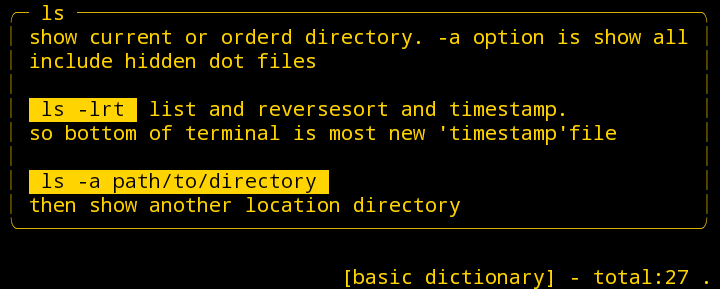

<p>

  
</p>


  
next strings here here here  

<h5>more next headding</h5>


> it show dictionaly your own wrote command usage and memo
> *and if not assigned show Built-in dictionary*  
> *You can also search for an excellent community base cheat sheet [tldr](https://tldr.sh)*  
> *and you can also set it to be displayed at the same time as your own.*  


## NOTE : *Now Making*  
> **The package has not been completed yet for Packaging, please wait.**  
> *If you want to try it even if it's not a compiled package, please try the explanation a little ahead* **pip from git method**

&nbsp;
## Install  

<h5>Ways 1</h5> using pip (from this repository) 

Package and install directly from this repository with pip  
```sh
pip install git+https://github.com/Suletta-Majo/uhelp.git
```  


<h5>Ways 2</h5> deb package 

*Download the latest release at the bottom that matches your computer's CPU architecture*  
*Cannot be installed on Termux!Proot-Distro environment is possible*
It is a deb package that uses the compiled Python source.

```sh
apt install ./uhelp-1.0.deb
```

&nbsp;

## Usage

If you install with pip, you can call it with `uh`,  
and if you install deb with apt, you can call it with `uh` or `uhelp`.

show your command reference below example `ls`

```sh
uh ls
```  
```sh
uhelp ls
```

*priority is User Dictionary > Built-in Dictionary*

&nbsp;


### Edit your own help item
```
uh -e [command name]
```
The text editor opens and you can edit it with reference to the description.


### Remove your own help item
```
uh -r [command name]
```


#### Change Theme
```
uh -v [theme name]
```
Now you can choose from 5 options: default, retro, retro2, simple, fruits

default
  

| retro                                | retro2                                |
| -------------------------------------| ------------------------------------- |
|| |  

| simple                               |fruits                                 |
| -------------------------------------| ------------------------------------- |
| | |  


### Tldr viwer Mode
```
uh -t [command name]
```
Command help mode using only TLDR pages


Check out the UHelp dictionary for other options such as backups and restores.


***

&nbsp;


As a bonus feature, there is a function to take a short note before falling asleep

```sh
uh -s i try fix suboutput function.but I think I'm going to sleep
```
```sh
uh -s "i try fix suboutput function.but I think I'm going to sleep"
```
Record up to 10 records

To view choose on  prompt 'no'


&nbsp;
## Author

👤 **Suletta-Majo**

* Github: [@Suletta-Majo](https://github.com/Suletta-Majo)

## Show your support

Give a ⭐️ if this project helped you!  


appendix: [A very useful tools used to create this page!!](appendix.md)  
  

***
_This README was generated with ❤️ by [readme-md-generator](https://github.com/kefranabg/readme-md-generator)_
