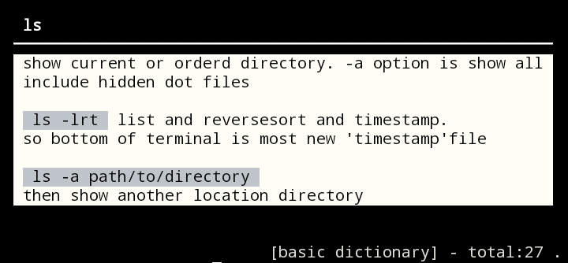

<h1 align="center">-Welcome to Your own help- 👋</h1>
<p>

  
</p>

&nbsp;
> it show dictionaly your own wrote command usage and memo

> *and if not assigned show Built-in dictionary*  
> *You can also search for an excellent community base cheat sheet [tldr](https://tldr.sh)*  
> *and you can also set it to be displayed at the same time as your own.*  


## NOTE : *Now Making*
> **The package has not been completed yet for Packaging, please wait.**  
> *If you want to try it even if it's not a compiled package, please try the explanation a little ahead* **pip from git method**

&nbsp;
## Install
Ways 1 using pip  

Package and install directly from this repository with pip
```sh
pip install git+https://github.com/Suletta-Majo/uhelp.git
```  

Regular pip command Use the one registered on PYPI
##### *in preparation. not work this*
```sh
pip install uhelp
```

Ways 2 using .deb  
*choose Debian deb package your CPU architecture*  

~~[x64](https://)~~&nbsp;/&nbsp;[arm64](https://) 

```sh
apt install ./uhelp-1.0.deb
```


## git clone  
Go to the directory you want to clone and use mkdir uhelpgit if necessary  

```sh
git clone https://github.com/Suletta-Majo/uhelp.git
```  

In that directory you can run like  

```sh
python3 ./uhelp.py ls
```  


```sh
uhelp ls
```


&nbsp;
## Usage

show your command reference below example ls

```sh
uhelp ls
```
*priority is User Dictionary > Built-in Dictionary*
&nbsp;

  
</p>
&nbsp;


### Edit your own help item
```
uhelp -e [command name]
```
The text editor opens and you can edit it with reference to the description.


### Remove your own help item
```
uhelp -r [command name]
```

#### Change Theme
```
uhelp -v [theme name]
```
Now you can choose from 5 options: default, retro, retro2, simple, fruits

default
  

| retro                                | retro2                                |
| -------------------------------------| ------------------------------------- |
|| |  

| simple                               |fruits                                 |
| -------------------------------------| ------------------------------------- |
| | |  


***

&nbsp;

As a bonus feature, there is a function to take a short note before falling asleep

```sh
uhelp -s i try fix suboutput function.but I think I'm going to sleep
```
```sh
uhelp -s "i try fix suboutput function.but I think I'm going to sleep"
```
Record up to 10 records

To view choose on  prompt 'no'


&nbsp;
## Author

👤 **Suletta-Majo**

* Github: [@Suletta-Majo](https://github.com/Suletta-Majo)

## Show your support

Give a ⭐️ if this project helped you!

appendix: [A very useful tools used to create this page!!](appendix.md) 

***
_This README was generated with ❤️ by [readme-md-generator](https://github.com/kefranabg/readme-md-generator)_
